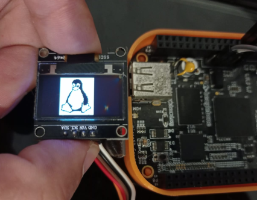

# SSD1306 OLED Display Linux Device Driver

This repository contains the Linux device driver for the SSD1306 OLED display. The SSD1306 is a monochrome OLED display, popular for its simplicity and ease of use in various embedded systems and IoT projects. This driver enables interaction with the display at the kernel level, providing a foundation for higher-level applications to utilize its features via a user-space interface.



## Features

- **Set Rotate:** Set the display rotation.
- **Horizontal Flip:** Flip the display horizontally.
- **Invert Display:** Inverts the display colors, turning black pixels to white and vice versa, to enhance visibility or for visual effects.
- **Clear Screen:** Clear the display screen.
- **Draw Pixel:** Draw a pixel at a specified location.
- **Draw Area:** Draw a rectangular area with custom data.

## Prerequisites

Before installing and using this driver, ensure your system meets the following requirements:

- Linux kernel version 4.x or higher.
- I2C support enabled in the kernel.
- Access to the I2C bus where the SSD1306 display is connected.

## Installation

1. Clone this repository to your local machine.
2. Navigate to the directory containing the driver source code.
3. Compile the driver using the appropriate kernel build system.
4. Insert the compiled module into the kernel: `sudo insmod ssd1306.ko`
5. Verify the driver is loaded correctly using `dmesg | grep SSD1306`.


## Integrating with Yocto Projects

To integrate the SSD1306 OLED I2C driver into your Yocto project, follow these steps:

1. **Prepare Your Yocto Layer**: If you don't already have a custom Yocto layer where you can place external recipes, create one using the `bitbake-layers create-layer` command. Let's assume this layer is named `meta-custom`.

2. **Add the SSD1306 Driver Recipe**: Copy the `ssd1306-driver.bb` recipe from this repository into your layer's recipe directory. For example, you might place it in `meta-custom/recipes-ssd1306/ssd1306-driver/`.

3. **Add Your Layer to the Build**: If your new layer (`meta-custom`) isn't already included in your build configuration, add it to your `bblayers.conf` file located in the `conf` directory of your Yocto build environment.

4. **Build the Driver**: You can now include the SSD1306 driver in your Yocto build. Add `ssd1306-driver` to your image recipe, or build it directly using BitBake:


## Device Tree Configuration

The driver is configured to work with a specific I2C bus and address via the device tree. A sample device tree snippet is provided in `ssd1306.dtsi`. Customize this according to your hardware setup.

```dts
// ssd1306.dtsi
&i2c2 {
    clock-frequency = <400000>; // Set I2C2 bus speed to 400kHz
    ssd1306_display: ssd1306@3C {
        compatible = "vendor,ssd1306";
        reg = <0x3C>;
        oled-lines = <64>;
        oled-columns = <128>;
        status = "okay";
    };
};
```

## Usage

The driver exposes a character device interface for user-space applications to interact with the display. Example operations include setting the display orientation, drawing pixels, and clearing the screen. For detailed usage instructions and examples, refer to the user-space application documentation available in [SSD1306-Tool](https://github.com/bdcabreran/ssd1306-tool/tree/master) repository 


### Writing to the Device

Write operations to the device can be performed using the standard `write()` system call. Commands are structured as data packets, each consisting of a command identifier followed by the necessary parameters.

### Supported Commands

- **Set Rotate:** Set the display rotation.
- **Horizontal Flip:** Flip the display horizontally.
- **Display Flip:** Flip the display vertically.
- **Clear Screen:** Clear the display screen.
- **Draw Pixel:** Draw a pixel at a specified location.
- **Draw Area:** Draw a rectangular area with custom data.

## User-Level Application

For higher-level control and to demonstrate the driver's capabilities, a separate user-level application is available. This application provides a convenient interface for interacting with the display, showcasing its functionalities through various demos and usage examples.

The application can be found in a separate repository: [SSD1306-Tool](https://github.com/bdcabreran/ssd1306-tool/tree/master)


## License

This project is licensed under the [MIT License](LICENSE.md) - see the LICENSE file for details.

## Author

**Bayron Cabrera**

- **GitHub:** https://github.com/bdcabreran
- **LinkedIn:** https://www.linkedin.com/in/bayron-cabrera-517821124/
- **Email:** bayron.nanez@gmail.com

---
